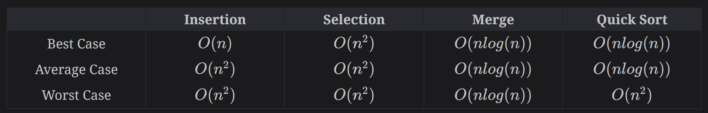
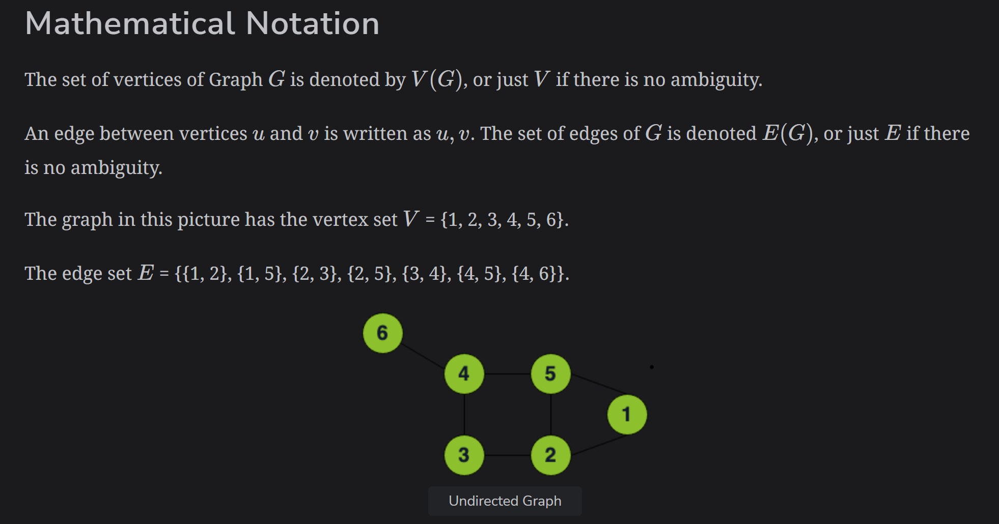
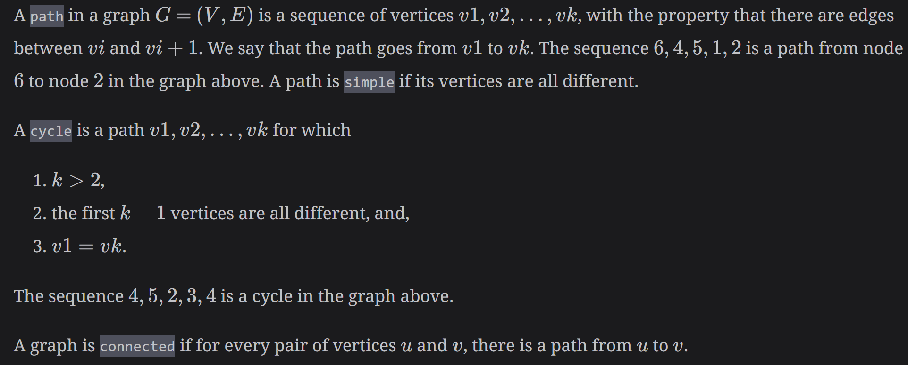

# Personal Notes for DSA

### Big-O Notation

### Helpful C++ stuff
1. Use `std:swap` from the algorithms library.
2. Every time the problem states time complexity should be O(log n) its almost always a Binary Search problem. Also everytime an array comes sorted, think of the Binary Search Algorithm.
3. yourString.substr(start_index, total_character_length). The followign will extract substring starting from start_index to the end of the string. yourString.substr(start_index).
4.  Deque data structure in C++ 
    `std::deque<int> deque;`
    `deque.push_back(10); // [10]`
    `deque.push_front(5); // [5, 10]`
    `deque.push_back(20); // [5, 10, 20]`
    `deque.front() // 5`
    `deque.back() // // 20`
    `deque.pop_front(); // [10, 20]`
    `deque.pop_back(); // [10]`
    `deque.size() // 1`
    `deque.empty()`
    `for (auto it = deque.begin(); it != deque.end(); ++it) {
        std::cout << " " << *it;
    }`
5. Here's how you deifne a max integer `int minLength = INT_MAX`
6. To check if a char is alpha numeric, you can use the function aisalnum(num) which returns a bool. alpha numeric includes a-z and 0-9
7. To convert a character to lowercae, you do tolower(”A”).

### Questions to Ask

#### Strings, Array & Numbers

1. Min/Max length of the array?
2. Min/Max size of elements within the array?
3. Does the array come sorted?
4. What are the type of elements? Numbers (integers or floating point?), string (is it a single-byte or multi-byte [unicode])?
5. If the problem involves finding a subsequence, does "subsequence" mean that the elements must be adjacent, or is there no such requirement? 
6. Does the array contain unique elements or duplicates? 

#### Grid/Mazes

1. For problems where some actor (e.g. a robot) is moving in a grid or maze, what moves are allowed? Can the robot move diagonally (hence 8 valid moves), or only horizontally/vertically (hence only 4 valid moves)?
2. Are all cells in the grid allowed, or can there be obstacles?
3. If the actor is trying to get from cell A to cell B, are cells A and B guaranteed to be different from each other?
4. If the actor is trying to get from cell A to cell B, is it guaranteed that there's a path between the two cells?

#### Graphs

1. How many nodes can the graph have?
2. How many edges can the grpah have?
3. If the edges have weights, what is the range for the weights?
4. Can there be loops in the graph? Can there be negative-sum loops in the graph?
5. Is the graph directed or undirected?
6. Does the graph have multiple edges and/or self-loops?

#### Return Values

1. What should my method return? For example, if I'm trying to find the longest subsequence of increasing numbers in an array, should I return the length, the start index, or both?
2. If there are multiple solutions to the problem, which one should I return?
3. If it should return multiple values, do you have any preference on what to return? E.g. should it return an object, a tuple, an array, or pass the output parameters as input references? (This may not be applicable in langugaes allowing you to return multiple values, e.g. Python)
4. What should I do/return if the input is invalid/does not match the constraints? Options may be to do nothing (always assume the input is correct), raise an exception, or return some specific value.
5. In problems where you're supposed to find something (e.g. a number in an array), what should be returned if the element is not present?

### Data Structures

#### Array

1. Collection of items of the same type stored continguously in memory.
2. Can be declared static or dynamic.
3. Generic definition of static array `datatype arrayName [size]`. 
    

### Algorithms

#### Algorithmic Paradigms
1. Brute Force: Go through all possibilities to find a solution to the problem. Generally no shortcuts, and no performance improvements. Inefficient, there is a guaranteed solution if one exists.
2. Greedy: builds solution piece by piece by choosing the next piece that offers the most obvious and immediate benefit. Locally-optimal choice for a globally optimal solution. Can also be used when optimal solution to subporblems leads to optimal for main problem. The disadvantage is that it is entirely possible that the most optimal short-term solution may lead to the worst possible long-term outcome!
3. Divide and Conquer: problem is repeatedly divided into sub-problems until we reach a point where each problem is similar and atomic (i.e. can’t be further divided). We then solve these atomic problems and combine the solutions together.
    1. Use recursion to divide the problem into smaller atomic problems until no further division is possible.
    2. Solve the atomic sub-problems.
    3. Repeatedly combine the solved sub-problems to formulate a solution for the original problem.
4. Dynamic Programming: solve problems by combining results of sub-problems.
    1. Overlapping Subporblems: the subproblems of a given problem are not independant; in other words, two subproblems don;t share a subproblem.
    2. Optimal Subsructure Property: The overall optimal solution of the problem can be constructed from the optimal solutions of its subproblems.
    3. Memoization (Top Down): Looks for the answer of a subproblem in a lookup table before computing its solution.
    4. Tabulation (Bottom Up): Avoids recursion by solving the "bottom-up" problems. This is typically done by filling up a lookup table, and computing the solution to the top/original problem based on the resutls in the table.

#### Overview of Sorting Algorithms
Here's the time complexity for each of the sorting algorithms:

#### Searching Algorithms
1. Brute Force - Linear Search: Go through all the elements to find the element you are looking for. O(N) time.
2. Binary Search: O(log n) time.

#### Graph Algorithms
1. A graph is an abstract notation used to represent the connection between pairs of objects, like roads, flights, the Internet etc. 
2. Graphs represent a pairwise relationship between objects, and are mathematical structures that can be visualized using `nodes` and `edges`.
    i. A `node`, also known as a vertex, is a fundamental part of a graph. It is the entity that has a name, known as the `key`, and other infomration related to that entity.
    ii. A relationship between `nodes` is expressed using `edges`. An `edge` between two nodes expresses a one-way or two-way relationship between `nodes`.
3. Graphs can be easily represented as **Adjacency Matrix** and **Adjacency List**.

## Coding Interview Patterns

#### 1. Sliding Window
1. Used to process sequential data by maintaining a moving subset of elements, called a window, used to reduce nested loops in an algorithm. Can be seen as a variation of the two pointers pattern, with the pointers being used to set the window bounds.
2. This method is not efficient if for each window, we iterate over all the elements of the window because that gives us the same `O(kn)` time complexity. Instead we focus on the element entering the window and the one leaving it.
3. Does my problem match this pattern?
    - Yes, if the problem requires repeated computations on a continguous set of data elements (a subarray or a substring). Or, if the computations performed every time the window moves takes `O(1)` time or are a slow-growing function, such as log, of a small variable, say `k`, where `k` << `n`.
    - No, if the input data structure does not support random access. You have to process the entire data without segmentation.
4. Problems that tackle this pattern:
- `187. Repeated DNA Sequences`
- `239. Sliding Window Maximum`
- `76. Minimum Window Substring`
- `187. Repeated DNA Sequences`
- `3. Longest Substring Without Repeating Characters`
- `209. Minimum Size Subarray Sum`
- `121. Best Time to Buy and Sell Stock`
- `Minimum Window Subsequence - Need to finish`

#### 2. Two Pointers
1. Used to traverse data structures such as arrays or linked lists in a coordinated manner, typically starting from different positions or moving in opposite directions.
2. When there's a requirement to find two data elements in an array that satisfy a certain condition, the two pointers pattern should be the first strategy to come to mind.
3. Does my problem match this pattern?
    - Yes, (i) if the input data can be traversed in a linear fashion, such as an array, linkedlist or string, (ii) You need to process data elements as pairs at two different positions simultaneously, (iii) You need dynamic pointer movement by moving pointers independantly of each other according to certain conditions or criteria. Both pointers might move along the same or two different data structures.
4. Problems that tackle this pattern:
- `125. Valid Palindrome`
- `15. 3Sum`

#### 3. Fast and Slow Pointers
1. Use two pointers to traverse data structures such as arrays or linked lists at different speeds, to identify patterns, detect cycles or find specific elements. This approach is not concerned with data values like two pointers.
2. Pointers start at the same location and then start moving at different speeds. Usually slow pointer moves by a factor of one and fast by a factor of two. If there is a cycle, then the pointers are bound to meet. Potential problems that can be solved with this approach: Middle of the Linked List & Detect cycle in an array.
3. Does my problem match this pattern?
    - Yes, if the following condition is fulfilled (i) Linear data structure(array, linked list or string) in addition to either (ii) Cycle or intersection detection (iii) Find the startign element at the second quantile: The problem involves finding the starting element of the second quantile (second half, second tertile, second quartile). For example, the problem asks to find the middle element of an array or a linked list.
4. Problems that tackle this pattern:
- `125. Valid Palindrome`
- `15. 3Sum`

#### 4. Merge Intervals
1. For problems involving merging of intervals, such as merging intersecting intervals, inserting new intervals into existing sets, or determining the minimum number of intervals needed to cover a given range.
2. Intervals could be non-overlapping, partially-overlapping and completely overlapping.
3. Does my problem match this pattern?
    - Yes, if both of these conditions are fulfilled (i) Input data is an array of intervals, (ii) problem states to deal with overlapping intervals, either to find their union, their intersection, or the gaps between them.

